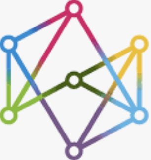

# 👋 Hi, I'm Yuval 

🔬 M.Sc. @ Technion, in the Autonomous Systems and Robotics program (TASP) 
🤖 Passionate about robotics and AI-driven autonomous systems  
🎓 B.Sc. in Mechanical Engineering, graduate of the Robotics, Control and Mechatronics specialization track @ Ben-Gurion University   

 

---

## 🛠️ Tech Stack

## 🧭 Interests & Direction
- 
 Planning and decision-making methods under uncertainty

- 
 Aiming to integrate these methods across the robotics pipeline - from perception, SLAM and state estimation to learning-based components and control

- 
 Seeking to bridge theoretical foundations and algorithmic frameworks with safety-aware and reliable behavior in real-world robotic systems/autonomous navigation
 
  
<!--
-   Member of the  <a href="https://anpl-technion.github.io/">Autonomous Navigation and Perception Lab (ANPL)</a>  

-->
---

## 🚀 Featured Projects
- **Weapon Zeroing System** *(Private Repository)* - Real-time laser aim calibration on Raspberry Pi.
  *Python, OpenCV, NumPy, gpiozero* | [Capstone Project - Grade 96]  

- **Escape Project** - Image processing & route planning in C  
  *C (pointers/structs), BMP I/O, DFS/BFS*  

- **STM32 Autonomous Line Follower** - PID control, obstacle detection & autonomous parking.  
  *STM32F103, Embedded C, HAL timers/interrupts*  

- **STM32 Propeller Swing Control (LQR)** - Model-matching + LQR reference model.  
  *Embedded C, STM32 HAL, MATLAB/Simulink*
  
- **Optimal Missile Guidance Using LQG Control** - Stochastic guidance: Riccati-based feedback, Kalman filtering, Monte Carlo analysis, and animated results.  
  *Python, NumPy, Matplotlib, Optimal Control*
  
- **Control Systems - SRV02 Rotflex** - Position & flexible joint control (PID, LQR, Observer, Z-N).  
  *MATLAB/Simulink*  

- **Robotics Control & Planning (4-DOF Arm)** - MATLAB dynamics + Python MPC with learning-based planning.  
  *MATLAB, Python, PyTorch (CVAE), NumPy*  

- **SCARA 6-DOF Robotic Arm** - FK/IK, Jacobian, workspace & ROS2 simulation (URDF, RViz, Gazebo).  
  *Python, ROS2, Gazebo, RViz*  

- **4-DOF Robotic Arm - Arduino Project** - Servo-based robotic arm with joystick control.  
  *Arduino (C++), Servo.h, DC motor driver, joysticks*  

---

## 🌐 Connect

-  <a href="mailto:yuval.marmor@campus.technion.ac.il">
    
    Email
  </a>
   
    
-  <a href="https://www.linkedin.com/in/yuval-marmor-robotics-ai/">
    
    LinkedIn
  </a>

