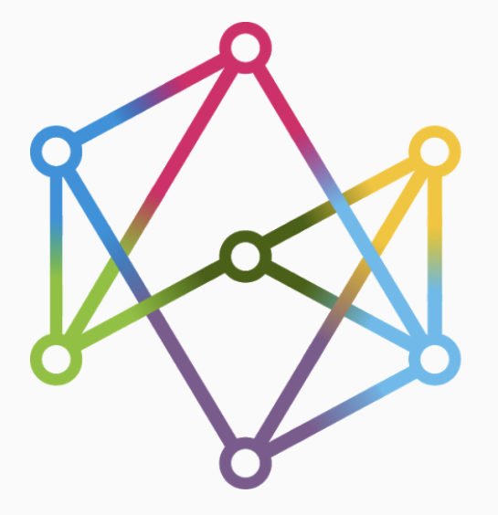

# 👋 Hi, I'm Yuval 

🔬 M.Sc. @ Technion, in the Autonomous Systems and Robotics program (TASP)  
🤖 Passionate about robotics and AI-driven autonomous systems  
🎓 B.Sc. in Mechanical Engineering, graduate of the Robotics, Control, and Mechatronics specialization track @ Ben-Gurion University   

 

---

## 🛠️ Tech Stack

---
## 🔬 Research Focus

• Planning under uncertainty & AI

• Semantic sensing, localization & mapping (SLAM)

  • 🧠 Member of the 
  <a href="https://anpl-technion.github.io/">Autonomous Navigation and Perception Lab (ANPL)</a>
  

---

## 🚀 Featured Projects
- **Weapon Zeroing System** *(Private Repository)* - Real-time laser aim calibration on Raspberry Pi  
  *Python, OpenCV, NumPy, gpiozero* | [Capstone Project - Grade 96]  

- **Escape Project** - Image processing & route planning in C  
  *C (pointers/structs), BMP I/O, DFS/BFS*  

- **STM32 Autonomous Line Follower** - PID control, obstacle detection & autonomous parking  
  *STM32F103, Embedded C, HAL timers/interrupts*  

- **STM32 Propeller Swing Control (LQR)** - Model-matching + LQR reference model  
  *Embedded C, STM32 HAL, MATLAB/Simulink*  

- **Control Systems - SRV02 Rotflex** - Position & flexible joint control (PID, LQR, Observer, Z-N)  
  *MATLAB/Simulink*  

- **Robotics Control & Planning (4-DOF Arm)** - MATLAB dynamics + Python MPC with learning-based planning  
  *MATLAB, Python, PyTorch (CVAE), NumPy*  

- **SCARA 6-DOF Robotic Arm** - FK/IK, Jacobian, workspace & ROS2 simulation (URDF, RViz, Gazebo)  
  *Python, ROS2, Gazebo, RViz*  

- **4-DOF Robotic Arm - Arduino Project** - Servo-based robotic arm with joystick control  
  *Arduino (C++), Servo.h, DC motor driver, joysticks*  

---

## 📊 GitHub Stats
  

---

## 🌐 Connect
- 📧 [Email](mailto:yuval5586871@gmail.com)  
- 💼 [LinkedIn](www.linkedin.com/in/yuval-marmor-robotics-ai)  
